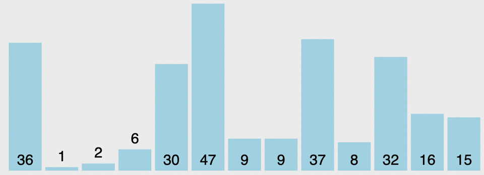

# Quick_Sort_Algorithm





> ## Merges two already sorted arrays: :wink:

> ## Pivot: :wink:
``` js
function pivot(arr, start=0, end=arr.length+1){
  function swap(array, i, j) {
    var temp = array[i];
    array[i] = array[j];
    array[j] = temp;
  }

  var pivot = arr[start];
  var swapIdx = start;

  for(var i = start + 1; i < arr.length; i++){
    if(pivot > arr[i]){
      swapIdx++;
      swap(arr,swapIdx,i);
    }
  }
  swap(arr,start,swapIdx);
  return swapIdx;
}
```

> ## Pivot with ES2015 Syntax: :wink:
``` js
function pivot(arr, start = 0, end = arr.length - 1) {
  const swap = (arr, idx1, idx2) => {
    [arr[idx1], arr[idx2]] = [arr[idx2], arr[idx1]];
  };

  // We are assuming the pivot is always the first element
  let pivot = arr[start];
  let swapIdx = start;

  for (let i = start + 1; i <= end; i++) {
    if (pivot > arr[i]) {
      swapIdx++;
      swap(arr, swapIdx, i);
    }
  }

  // Swap the pivot from the start the swapPoint
  swap(arr, start, swapIdx);
  return swapIdx;
}

pivot([4,8,2,1,5,7,6,3])
```

> ## Quick_Sort: :laughing:
``` js
function quickSort(arr, left = 0, right = arr.length -1){
    if(left < right){
        let pivotIndex = pivot(arr, left, right) //3
        //left
        quickSort(arr,left,pivotIndex-1);
        //right
        quickSort(arr,pivotIndex+1,right);
      }
     return arr;
} 
           
quickSort([100,-3,2,4,6,9,1,2,5,3,23])

// [4,6,9,1,2,5,3]
// [3,2,1,4,6,9,5]
//        4
//  3,2,1    6,9,5
//      3      6
//  2,1      5  9
//    2
//  1
```
